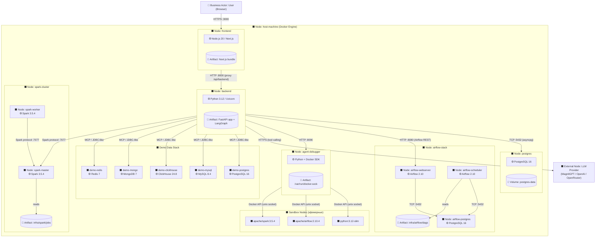

# 3.1 Схема физической реализации (ArchiMate)

> Источник модели: [`3_1_physical_architecture.archimate`](./3_1_physical_architecture.archimate) — открывается в Archi (https://www.archimatetool.com). Файл сгенерирован скриптом `scripts/generate_archimate_physical.py`; при изменении состава контейнеров достаточно перезапустить скрипт, и модель перестроится автоматически.

Схема физической реализации описывает технологический уровень (Technology Layer) приложения **AI Data Engineer Assistant** в нотации ArchiMate 3.x. На диаграмме отражены вычислительные узлы (Node), системное ПО и среды исполнения (System Software), развёрнутые программные артефакты (Artifact), а также коммуникационные пути (Path) между ними. Все компоненты разворачиваются средствами Docker Compose на одном хост-узле (рабочая станция разработчика либо сервер с Docker Engine); сетевое взаимодействие осуществляется внутри bridge-сети Docker, наружу проброшены только пользовательские порты.

## Как открыть в Archi

1. Установить Archi 5.x с https://www.archimatetool.com.
2. `File → Open` → выбрать `docs/3_1_physical_architecture.archimate`.
3. В Models раскрыть «AI Data Engineer Assistant - Physical Architecture» → `Views` → «3.1 Схема физической реализации».
4. Для экспорта в диплом: `Edit → Copy view as image (PNG)` или `File → Export → Image / PDF`.

## 3.1.1 Состав узлов технологического уровня

Узлы ArchiMate соответствуют контейнерам Docker, объединённым на физическом хосте. Ниже сведены ключевые узлы, артефакты и предоставляемые ими технологические сервисы.

| ArchiMate-узел (Node) | Образ / артефакт (Artifact) | System Software | Technology Service | Внешний порт |
| --- | --- | --- | --- | --- |
| `host-machine` | — | Docker Engine, OS (Darwin/Linux) | Container runtime, виртуальная сеть | — |
| `frontend` | `frontend/Dockerfile` → Next.js bundle | Node.js 20 | Web UI (SSR + клиентский SPA) | `3000` |
| `backend` | `backend/Dockerfile` → FastAPI app | Python 3.12, Uvicorn | REST API, LangGraph агент, MCP-клиент | `8000` |
| `postgres` | `postgres:16-alpine` | PostgreSQL 16 | Хранилище пользователей, сессий, артефактов | `5432` |
| `airflow-postgres` | `postgres:16-alpine` | PostgreSQL 16 | Метаданные Airflow | внутренний |
| `airflow-init` | `apache/airflow:2.10.4` | Airflow 2.10 CLI | Миграции БД, создание admin | — |
| `airflow-webserver` | `apache/airflow:2.10.4` | Airflow Webserver | Airflow REST API + UI | `8080` |
| `airflow-scheduler` | `apache/airflow:2.10.4` | Airflow Scheduler | Планирование и запуск DAG | внутренний |
| `spark-master` | `apache/spark:3.5.4` | Spark Master | Координация задач, Master UI | `7077`, `8081` |
| `spark-worker` | `apache/spark:3.5.4` | Spark Worker | Исполнение Spark-задач | внутренний |
| `agent-debugger` | `infra/debugger/Dockerfile` | Python + Docker SDK | Запуск user-scoped sandbox-контейнеров | `8090` |
| `demo-postgres` | `postgres:16-alpine` | PostgreSQL 16 | Аналитическая demo-БД | `15433` |
| `demo-mysql` | `mysql:8.4` | MySQL 8.4 | Demo-БД (OLTP) | `13306` |
| `demo-clickhouse` | `clickhouse/clickhouse-server:24.8` | ClickHouse 24.8 | Demo-БД (OLAP) | `18123` / `19000` |
| `demo-mongo` | `mongo:7` | MongoDB 7 | Demo NoSQL document store | `27018` |
| `demo-redis` | `redis:7-alpine` | Redis 7 | Demo key-value кэш | `16379` |
| `sandbox-runner-*` | `python:3.12-slim` / `apache/airflow:2.10.4` / `apache/spark:3.5.4` | Эфемерные контейнеры | Изолированный запуск Python / DAG-import / Spark-скриптов | — |
| `llm-provider` (внешний) | MagnitGPT / OpenAI / OpenRouter | HTTPS endpoint | LLM tool calling | TLS 443 |

Постоянные артефакты данных хранятся в Docker-томах: `postgres-data`, `airflow-postgres-data`, `airflow-logs`, `demo-postgres-data`, `demo-mysql-data`, `demo-clickhouse-data`, `demo-mongo-data`, `demo-redis-data`. Артефакты исходного кода и пользовательских DAG/Spark-скриптов монтируются с хоста: `./infra` → `/workspace/infra` (backend, agent-debugger), `./infra/airflow/dags` → `/opt/airflow/dags`, `./infra/spark/jobs` → `/opt/spark/jobs`. Для sandbox-узла дополнительно проброшен Docker socket (`/var/run/docker.sock`), что позволяет создавать дочерние контейнеры через Docker API.

## 3.1.2 Коммуникационные пути

- HTTPS/HTTP (REST): браузер → `frontend:3000`; `frontend` → `backend:8000` (server-side proxy `/api/backend/*`); `backend` → `airflow-webserver:8080`, `agent-debugger:8090`, внешний `llm-provider`.
- TCP (СУБД): `backend` → `postgres:5432`; Airflow-узлы → `airflow-postgres:5432`; `backend` (через MCP/SQL tool) → `demo-postgres:5432`, `demo-mysql:3306`, `demo-clickhouse:9000/8123`, `demo-mongo:27017`, `demo-redis:6379`.
- Spark protocol: `backend` → `spark-master:7077`; `spark-worker` ↔ `spark-master:7077`.
- Docker API (Unix socket): `agent-debugger` → `host-machine` → запуск sandbox-узлов (`python:3.12-slim`, `apache/airflow:2.10.4`, `apache/spark:3.5.4`).
- Filesystem bind-mount: `host-machine:/infra` ↔ `backend`, `airflow-*`, `spark-*`, `agent-debugger`; `host-machine:${SANDBOX_HOST_RUNS_DIR}` ↔ `agent-debugger` и sandbox-контейнеры.

## 3.1.3 ArchiMate-диаграмма (Technology Layer)

Диаграмма построена в нотации ArchiMate: прямоугольники со скруглёнными углами обозначают **Node**, вложенные элементы — **System Software** и **Artifact**, стрелки — **Path/Flow** (коммуникационные пути).

## 3.1.4 Текстовое описание элементов ArchiMate

- **Node `host-machine`** — физический/виртуальный хост с установленным Docker Engine. Реализует среду исполнения всех контейнеризированных узлов и предоставляет сетевой bridge.
- **Node `frontend`** содержит **System Software** Node.js 20 и **Artifact** Next.js bundle (SSR + клиентский SPA). Реализует пользовательский интерфейс.
- **Node `backend`** содержит **System Software** Python 3.12 + Uvicorn и **Artifact** FastAPI-приложение с агентским ядром на LangGraph и MCP-клиентами. Реализует **Technology Service** «REST API AI-агента».
- **Node `postgres`** (System Software PostgreSQL 16) с **Artifact** Docker-том `postgres-data` хранит пользователей, сессии, сообщения, tool runs, версии артефактов.
- **Group `airflow-stack`** объединяет узлы `airflow-webserver`, `airflow-scheduler`, `airflow-postgres` и общий **Artifact** `infra/airflow/dags` (bind-mount). Реализует **Technology Service** оркестрации пайплайнов.
- **Group `spark-cluster`** содержит `spark-master` и `spark-worker` плюс **Artifact** `infra/spark/jobs`. Реализует **Technology Service** распределённой обработки.
- **Node `agent-debugger`** через проброшенный Docker socket (**Artifact** `/var/run/docker.sock`) создаёт эфемерные **Node**'ы sandbox-окружения для безопасного исполнения пользовательского кода.
- **Sandbox Nodes** — короткоживущие контейнеры, формируемые на образах `python:3.12-slim`, `apache/airflow:2.10.4`, `apache/spark:3.5.4`. Рабочие каталоги изолируются по пользователю (`SANDBOX_HOST_RUNS_DIR/users/<user_id>/run-*`).
- **Group `Demo Data Stack`** — узлы demo-СУБД (PostgreSQL, MySQL, ClickHouse, MongoDB, Redis), используемые агентом через MCP/SQL tools.
- **External Node `LLM Provider`** — внешний технологический сервис; backend взаимодействует с ним по HTTPS (`/chat/completions` или Responses API) для tool calling.
- **Business Actor `User`** — пользователь в браузере, инициирующий запросы через HTTPS.

## 3.1.5 Соответствие принципам ArchiMate

- Каждый Docker-сервис рассматривается как самостоятельный **Node**, исполняющий конкретные **Artifact**'ы (программные сборки) и предоставляющий **Technology Service** уровню Application.
- Тома (`*-data`, `airflow-logs`) и bind-mount каталоги представлены как **Artifact**'ы данных, что соответствует ArchiMate-семантике пассивных технологических объектов.
- Связи между узлами выражены как **Path** (физическое соединение) и **Flow** (направление обмена данными) с указанием транспорта и порта.
- Группировка `airflow-stack`, `spark-cluster`, `Demo Data Stack` отражает **Grouping**-элемент ArchiMate — логическое объединение узлов одной функциональной области без отдельного коммуникационного интерфейса.
